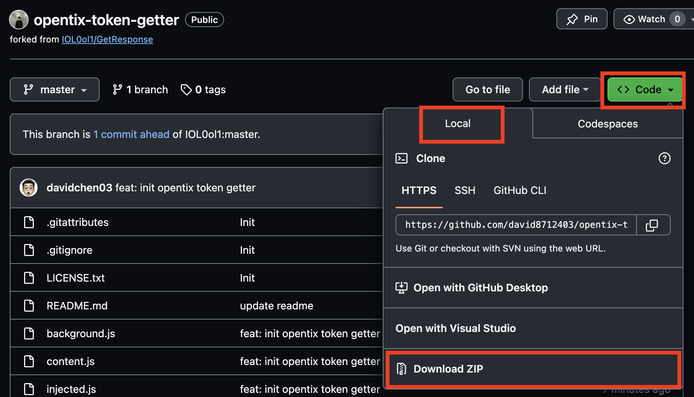
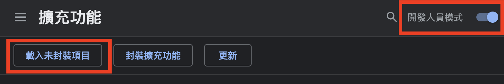
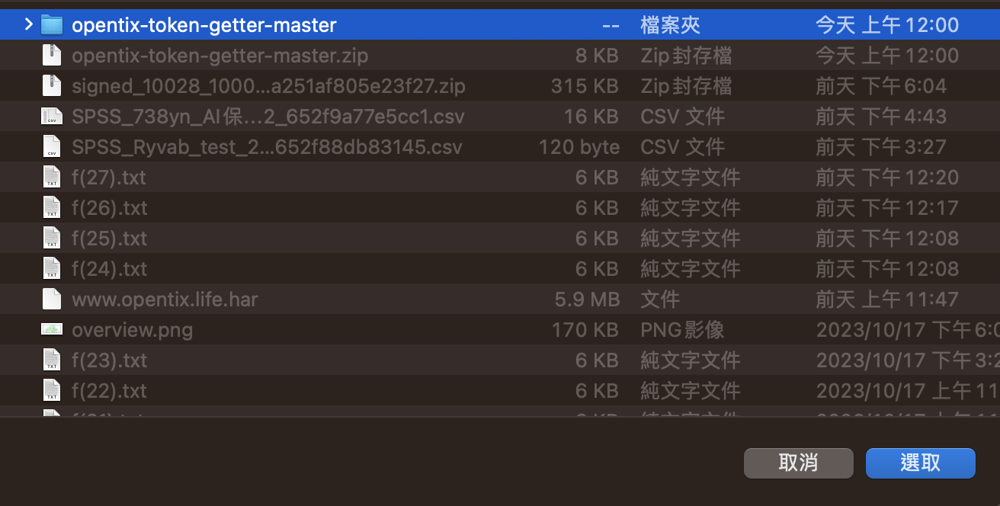
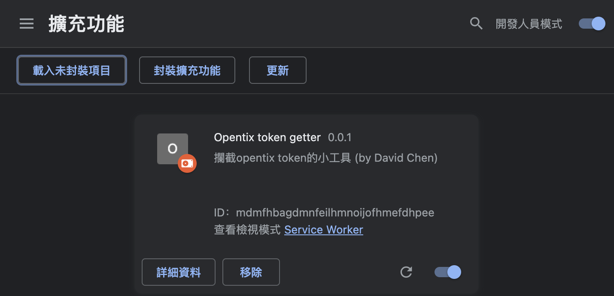
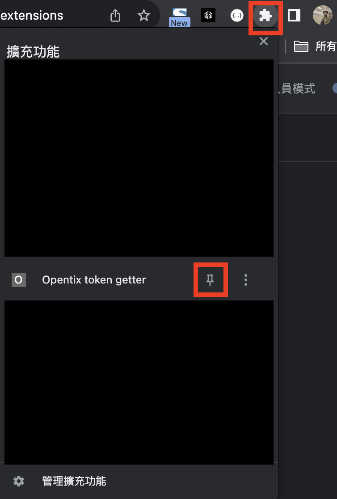
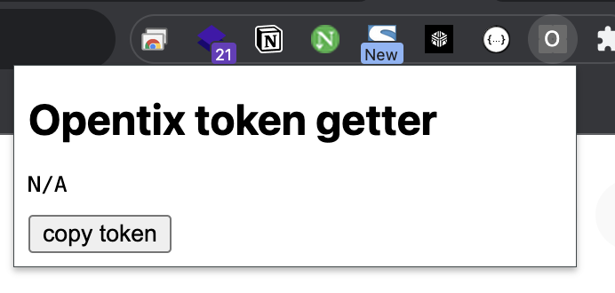
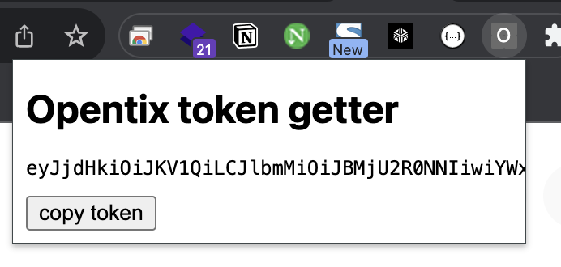

# Opentix token getter

這是一個簡單獲取opentix refresh token的chrome extension
forked from: [IOL0ol1/GetResponse](https://github.com/IOL0ol1/GetResponse)

# 安裝步驟
1. 下載此專案的zip檔案，並解壓縮
    

2. 開啟瀏覽器，進入extension頁面 [chrome://extensions/](chrome://extensions/)
   
3. 開啟開發人員模式、載入未封裝項目
    

4. 選擇步驟1.解壓縮後的資料夾
   
   

5. 釘選擴充套件
   
   此時應該會長這樣
   

# 獲取token
1. 開啟[opentix登入頁](https://www.opentix.life/login)(如果是登入狀態，請重新登入)
2. 登入成功後，再次點開擴充套件面板，就會出現refreshToken
   
   > 如果仍顯示`N/A`，請F5刷新頁面後，再重新登入一次
   